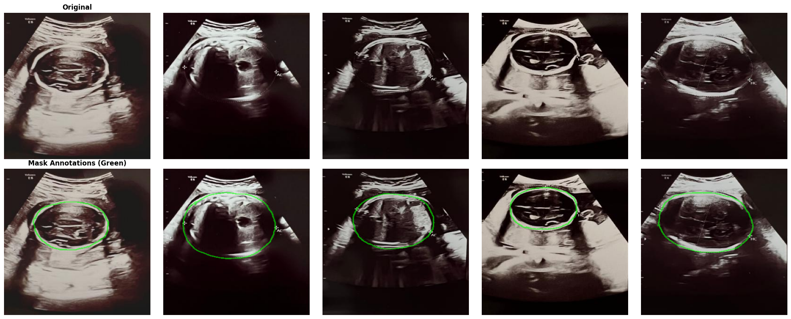
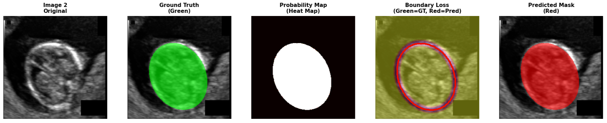
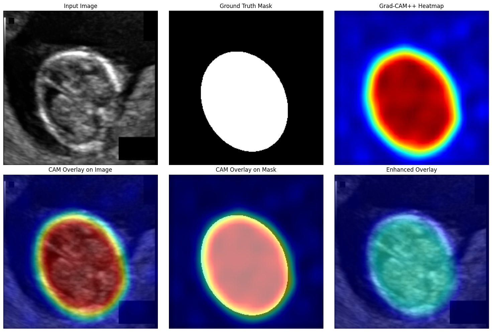

# Explainable-Deep-Learning-for-Automated-Fetal-Biometric-Estimation-from-Ultrasound-Images

## Abstract

Fetal health monitoring is a vital component of prenatal care. While ultrasonography remains the primary imaging modality for assessing fetal development and detecting anomalies, manual interpretation of ultrasound scans is time-consuming, error-prone, and highly dependent on operator expertise.
This project presents an **AI-enhanced ultrasound monitoring system** that automates the **segmentation and analysis of fetal anatomical structures** using deep learning. The system improves diagnostic precision, reduces examination time, and minimizes interobserver variability.

---

## Project Overview

We developed and evaluated multiple deep learning–based segmentation models for fetal ultrasound images. The system focuses on accurate fetal head segmentation and biometric estimation, supported by explainable AI techniques to improve transparency and clinical trust.

---

## Datasets

  

### Public Dataset

link: https://hc18.grand-challenge.org

* **1,335 fetal head ultrasound images**
* Binary segmentation masks
* Pixel-size metadata
* Ground-truth head and abdominal circumference measurements

### Private Clinical Dataset (Novel Contribution)

* **300 2D fetal ultrasound scans**
* Collected from **Aalok Diagnostic and Hospital, Dhaka, Bangladesh**
* Acquired using **Samsung WS80A Elite**
* Gestational age range: **18–38 weeks**
* Expert manual annotations by certified radiologists
* Includes:

  * Ultrasound images
  * Biometric measurements
  * Clinical annotations

The combined dataset enables robust fetal growth estimation and anomaly detection.

---

## Models Evaluated

The following segmentation architectures were implemented and compared:

* MedSegDiff-V2
* DUCK-Net
* Attention U-Net
* U-NeXt
* TransUNet

---

  

## Evaluation Metrics

Model performance was assessed using:

* Dice Score
* Intersection over Union (IoU)
* Recall
* Mean Average Precision (mAP)
* Training Time

---

## Results

### Fetal Head Segmentation Performance (Combined Dataset)

| Metric        | **MedSegDiff-V2** | DUCK-Net | Attention U-Net | U-NeXt | TransUNet |
| ------------- | ----------------- | -------- | --------------- | ------ | --------- |
| Test Dice     | **0.9852**        | 0.9682   | 0.9671          | 0.9615 | 0.9556    |
| Test IoU      | **0.9726**        | 0.9395   | 0.9365          | 0.9251 | 0.9128    |
| Recall        | **0.9864**        | 0.9699   | 0.9622          | 0.9630 | 0.9579    |
| mAP           | **0.961**         | 0.932    | 0.920           | 0.918  | 0.901     |
| Training Time | **70 min**        | 175 min  | 41 min          | 40 min | 33 min    |

**MedSegDiff-V2** achieved the highest segmentation accuracy with a Dice score of **0.9887** and IoU of **0.9780**, while maintaining efficient training time. It clearly outperformed other models in both performance and efficiency.

---

## Explainable AI

To enhance interpretability, **Grad-CAM** was applied to the top-performing model. This allows visualization of critical regions influencing predictions, improving clinical understanding and trust in AI-based decisions.

  

---

## Clinical Impact

* Reduced examination and reporting time
* Lower interobserver variability
* Improved diagnostic accuracy
* Early detection support for fetal growth abnormalities such as:

  * Intrauterine Growth Restriction (IUGR)
  * Macrosomia

---

## Technologies Used

* Python
* PyTorch
* OpenCV
* NumPy
* Matplotlib

---

## Future Work

* Multi-organ fetal segmentation
* Real-time ultrasound integration
* Multi-center dataset validation
* Clinical decision support system deployment

---

## Disclaimer

This project is intended **for research and clinical decision support only**. It is not a substitute for professional medical diagnosis.

---

